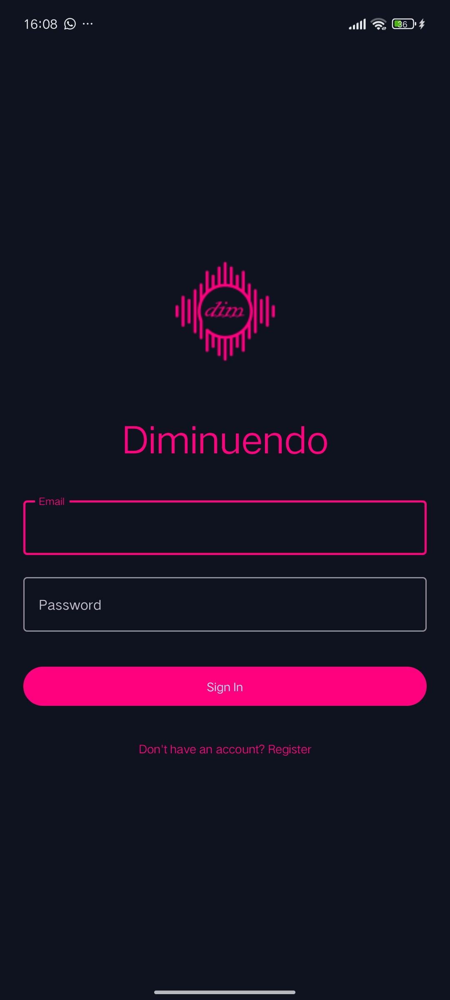
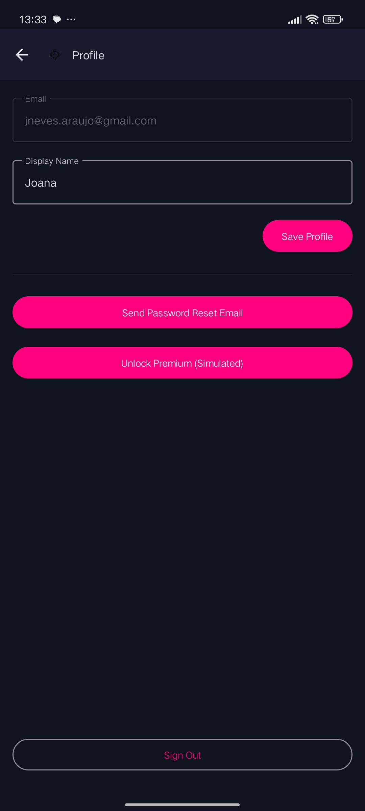

<!--
  This README is the PUBLIC FACE of YOUR project.
  Replace the example content with that of your application.
  Do NOT put AI instructions here — that lives in AGENTS.md.
-->

<!-- Replace X and Title -->
# Assignment `Final Project: Diminuendo App`

**Course:**  Mobile Application Development (DAM)

**Student Number:** `50274`

**Student Name:** `Joana Araújo`

**Student Email:** `a50274@alunos.isel.pt`

**Student class:** `61N`

**Student GitHub:** `https://github.com/ISEL-LEIM-DAM-SV2526/final-project-jnevesaraujo`

**Date:** `June 14, 2026`


# <App Name>

> Short sentence describing what the app does and for whom.


## Demo

<!-- Screenshot(s) or GIF of the app running. -->

| Screen | Screen | Screen |
|:---:|:---:|:---:|
|  |  |  |
|  |  |  |
|  |  |  |
|  |  |  |


## Features

- [x] Screen 1 — ...
- [x] Screen 2 — ...
- [x] State sharing between users
- [x] AI integration (remote API / local model)
- [x] Multimedia (audio)
- [x] Freemium model (free usage + simulated paid subscription)
- [x] Offline mode

## Stack

Kotlin · Jetpack Compose · Material 3 · Navigation Compose · ViewModel · MVVM ·
StateFlow · Repository Pattern · Hilt/Koin · Retrofit/Ktor · Coil · Room · DataStore.

## How to run

```bash
git clone <repo>
cd <repo>
# Configure secrets (see docs/10_security_and_permissions.md)
cp local.properties.example local.properties   # and fill in the keys
./gradlew assembleDebug
```

Open in Android Studio (recommended version in `docs/06_architecture.md`) and run on an
emulator/device with the indicated minimum API.

## Architecture

Short summary + diagram. Full detail in [`docs/06_architecture.md`](docs/06_architecture.md).

```
📂 dam.a50274.diminuendo
├── 📂 di
│   └── 📄 AppModule, AuthModule, DatabaseModule, DataStoreModule, RepositoryModule, WorkerModule
├── 📂 domain
│   ├── 📂 model
│   │   └── 📄 Measurement, NoiseZone, User, ChatMessage, NoiseClassification
│   ├── 📂 repository
│   │   └── 📄 Repository interfaces
│   ├── 📂 usecase
│   │   └── 📄 CheckEntitlementUseCase, SaveMeasurementUseCase, GetMeasurementHistoryUseCase, DeleteMeasurementUseCase
│   └── 📂 util
│       └── 📄 NetworkMonitor interface
├── 📂 data
│   ├── 📂 local
│   │   └── 📄 Room database, DAOs, entities, type converters, DataStore keys
│   ├── 📂 remote
│   │   └── 📄 Firestore DTOs, AuthRepositoryImpl
│   ├── 📂 repository
│   │   └── 📄 MeasurementRepositoryImpl, NoiseZoneRepositoryImpl, AudioCaptureRepositoryImpl, LocationRepositoryImpl, SubscriptionRepositoryImpl
│   ├── 📂 mapper
│   │   └── 📄 Extension functions mapping between Entity ↔ Domain ↔ DTO
│   ├── 📂 worker
│   │   └── 📄 SyncMeasurementsWorker
│   └── 📂 util
│       └── 📄 NetworkMonitorImpl
└── 📂 ui
    ├── 📂 navigation
    │   └── 📄 NavGraph, AppShell, type-safe route objects
    ├── 📂 theme
    │   └── 📄 Material 3 colour schemes, typography
    ├── 📂 components
    │   └── 📄 NoiseClassificationExt
    └── 📂 feature
        ├── 📂 auth (Screen, ViewModel, UiState, Action)
        ├── 📂 capture (Screen, ViewModel, UiState, Action)
        ├── 📂 diary (Screen, ViewModel, UiState, Action)
        ├── 📂 heatmap (Screen, BottomSheet, ViewModel, UiState, Action, Event)
        ├── 📂 ai (Screen, ViewModel, UiState, Action, Event)
        ├── 📂 paywall (Screen, ViewModel, Event)
        ├── 📂 profile (Screen, ViewModel, UiState)
        └── 📂 splash (ViewModel)

```


## Documentation

All the engineering design is in [`docs/`](docs/). Decisions in [`docs/adr/`](docs/adr/).

## Team

| Name | No. | Role |
|---|---|---|
| | | |

## AI Usage

This project was developed with the assistance of AI tools according to the rules in
[`AGENTS.md`](AGENTS.md). Usage log in
[`docs/14_ai_usage_log.md`](docs/14_ai_usage_log.md) and reflection in
[`docs/15_postmortem.md`](docs/15_postmortem.md).

## License

See [`LICENSE`](LICENSE).
