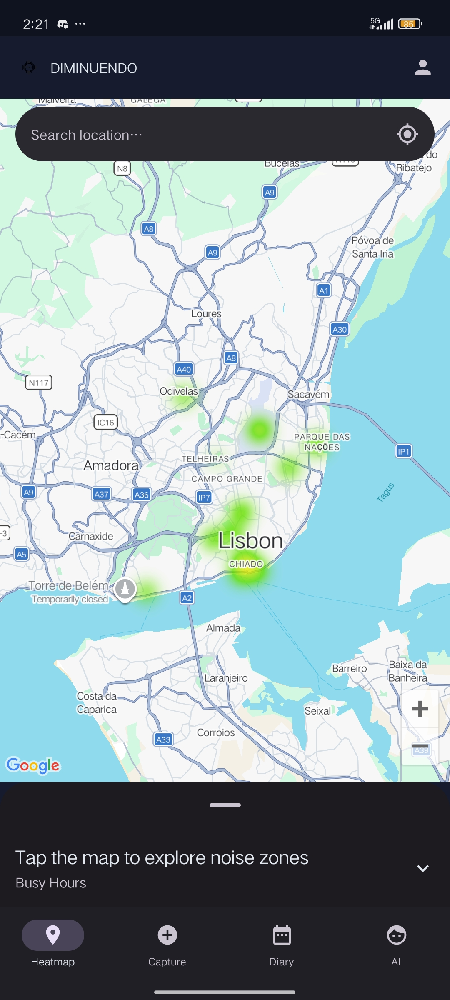
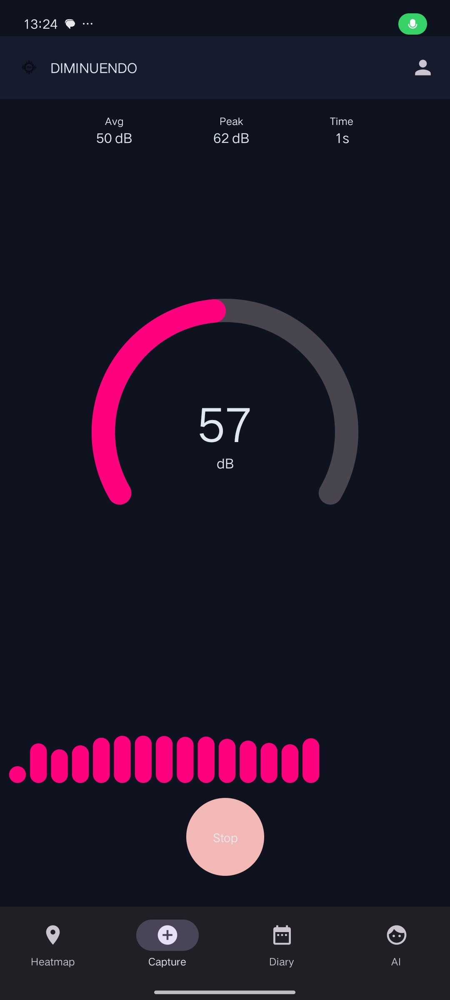
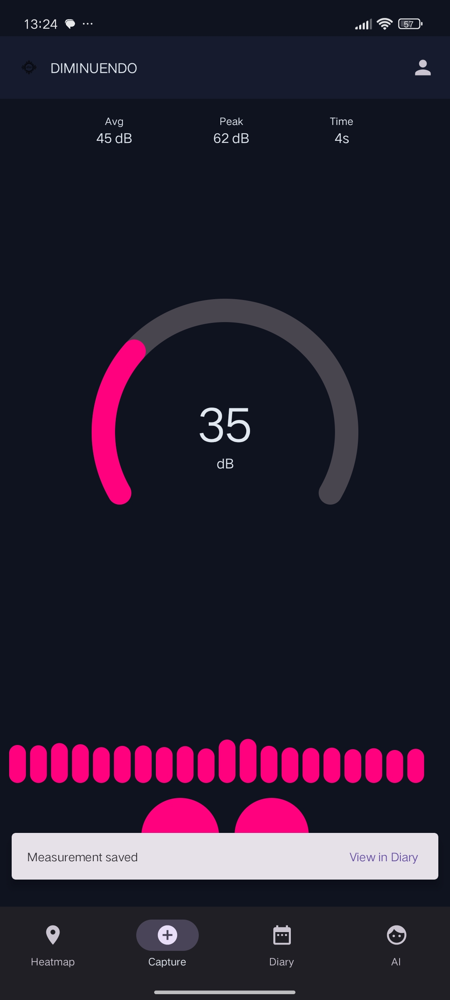
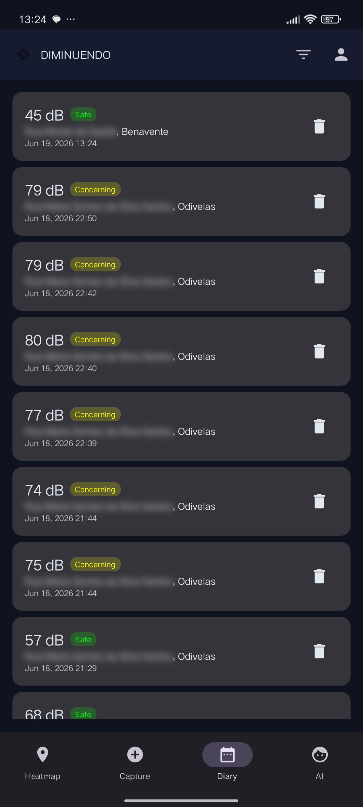
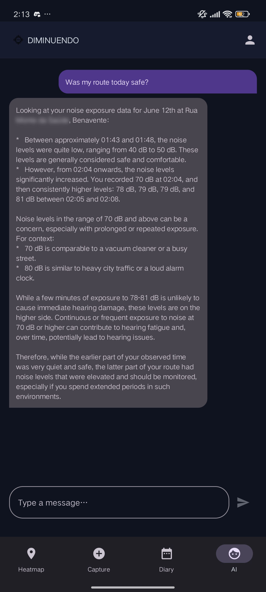
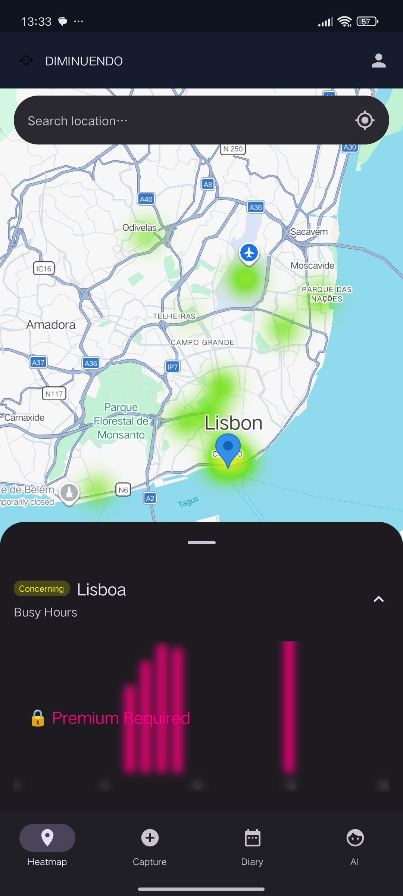
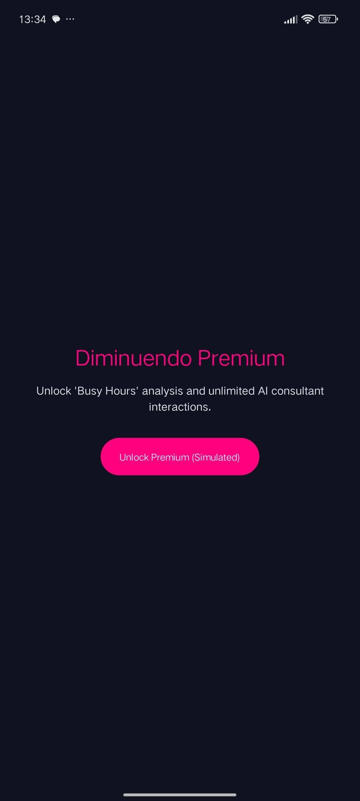
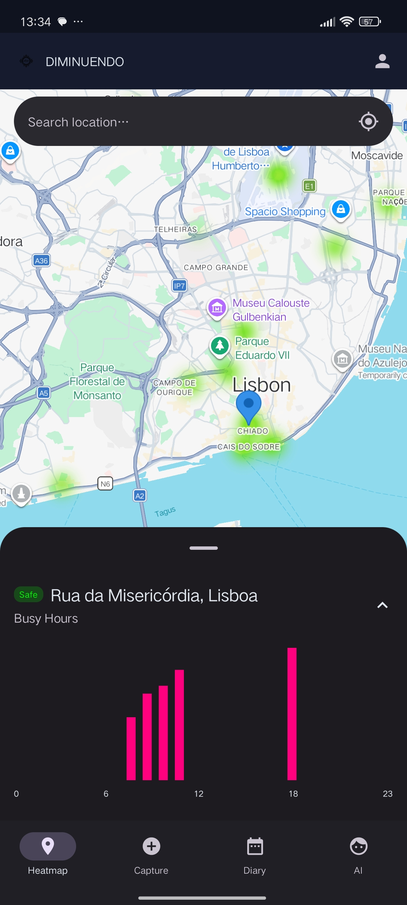

<!--
  This README is the PUBLIC FACE of YOUR project.
  Replace the example content with that of your application.
  Do NOT put AI instructions here — that lives in AGENTS.md.
-->

<!-- Replace X and Title -->
# Assignment `Final Project: Diminuendo App`

**Course:**  Mobile Application Development (DAM)

**Student Number:** `50274`

**Student Name:** `Joana Araújo`

**Student Email:** `a50274@alunos.isel.pt`

**Student class:** `61N`

**Student GitHub:** `https://github.com/ISEL-LEIM-DAM-SV2526/final-project-jnevesaraujo`

**Date:** `June 14, 2026`


# Diminuendo

> A crowdsourced urban noise monitoring app for Android — measure environmental sound levels, contribute to a shared heatmap, and get personalised health advice from an AI consultant.


-blue)
-blue)

## Demo

<!-- Screenshot(s) or GIF of the app running. -->

| Screen | Screen | Screen |
|:---:|:---:|:---:|
|  |  |  |
|  |  |  |
|  |  |  |
|  | - | - |


## Features
 
- [x] **Auth Screen** — Email/password sign-in and registration via Firebase Authentication, with session persistence across app restarts
- [x] **Sound Capture Screen** — Real-time decibel meter using the device microphone, with live waveform visualisation and one-tap save to the personal diary
- [x] **Noise Heatmap Screen** — Google Maps overlay showing crowdsourced noise zones; supports location search, map tap to inspect zone details, and a Busy Hours bar chart (premium)
- [x] **Exposure Diary Screen** — Personal log of all saved measurements with timestamps, location names, noise classification badges, and pending-sync indicators
- [x] **AI Consultant Screen** — Gemini 2.5 Flash chatbot that analyses the user's ten most recent diary entries and provides personalised noise exposure advice
- [x] **State sharing between users** — Measurements are aggregated into shared `noise_zones` documents in Firestore via atomic transactions; all clients receive live updates via snapshot listeners
- [x] **AI integration** — Google AI Studio SDK (Gemini 2.5 Flash) with diary context injection and streaming response rendering
- [x] **Multimedia** — Device microphone sampled via `AudioRecord`; RMS amplitude computed from the PCM buffer and converted to dB; raw audio is never written to disk
- [x] **Freemium model** — Free tier includes the real-time meter, heatmap view, and 3 AI prompts per day; Premium (simulated) unlocks Busy Hours charts and unlimited AI interactions; state persisted in DataStore
- [x] **Offline mode** — Room is the single source of truth; measurements saved offline are flagged `pendingSync = true` and uploaded by `WorkManager` when connectivity is restored

## Stack

| Layer | Technology |
|---|---|
| Language | Kotlin 2.0 |
| UI | Jetpack Compose · Material Design 3 |
| Navigation | Navigation Compose (type-safe routes) |
| State management | ViewModel · StateFlow · `stateIn(WhileSubscribed(5000))` |
| Architecture | MVVM · Repository Pattern · Clean Architecture layers |
| Dependency injection | Hilt |
| Local database | Room (SQLite) |
| Background sync | WorkManager |
| Preferences | Jetpack DataStore |
| Remote backend | Firebase Authentication · Cloud Firestore |
| Maps | Google Maps SDK · Maps Compose · `HeatmapTileProvider` |
| AI | Google AI Studio SDK (Gemini 2.5 Flash) |
| Testing | JUnit 4 · MockK · Turbine · kotlinx-coroutines-test · Robolectric |
| CI | GitHub Actions |

## Setup
 
1. Clone the repository
2. Create `local.properties` at the project root (this file is gitignored):
```properties
MAPS_API_KEY=your_google_maps_android_api_key
GEMINI_API_KEY=your_google_ai_studio_api_key
```
3. Add your `google-services.json` to the `app/` directory (obtain from the Firebase console)
4. Open in Android Studio Ladybug (2024.2.1) or later
5. Run on a physical device or emulator with API 26+
> Note: Google Maps tile loading and GMS-dependent features may not work correctly on emulators without Play Services. Testing on a real device is recommended.

Open in Android Studio (recommended version in `docs/06_architecture.md`) and run on an
emulator/device with the indicated minimum API.

## Architecture

MVVM + Repository pattern with three strict layers. The UI never imports Room entities or Firestore DTOs — it only works with domain model classes. Full detail in [`docs/06_architecture.md`](docs/06_architecture.md).

```
📂 dam.a50274.diminuendo
├── 📂 di
│   └── 📄 AppModule, AuthModule, DatabaseModule, DataStoreModule, RepositoryModule, WorkerModule
├── 📂 domain
│   ├── 📂 model
│   │   └── 📄 Measurement, NoiseZone, User, ChatMessage, NoiseClassification
│   ├── 📂 repository
│   │   └── 📄 Repository interfaces
│   ├── 📂 usecase
│   │   └── 📄 CheckEntitlementUseCase, SaveMeasurementUseCase, GetMeasurementHistoryUseCase, DeleteMeasurementUseCase
│   └── 📂 util
│       └── 📄 NetworkMonitor interface
├── 📂 data
│   ├── 📂 local
│   │   └── 📄 Room database, DAOs, entities, type converters, DataStore keys
│   ├── 📂 remote
│   │   └── 📄 Firestore DTOs, AuthRepositoryImpl
│   ├── 📂 repository
│   │   └── 📄 MeasurementRepositoryImpl, NoiseZoneRepositoryImpl, AudioCaptureRepositoryImpl, LocationRepositoryImpl, SubscriptionRepositoryImpl
│   ├── 📂 mapper
│   │   └── 📄 Extension functions mapping between Entity ↔ Domain ↔ DTO
│   ├── 📂 worker
│   │   └── 📄 SyncMeasurementsWorker
│   └── 📂 util
│       └── 📄 NetworkMonitorImpl
└── 📂 ui
    ├── 📂 navigation
    │   └── 📄 NavGraph, AppShell, type-safe route objects
    ├── 📂 theme
    │   └── 📄 Material 3 colour schemes, typography
    ├── 📂 components
    │   └── 📄 NoiseClassificationExt
    └── 📂 feature
        ├── 📂 auth (Screen, ViewModel, UiState, Action)
        ├── 📂 capture (Screen, ViewModel, UiState, Action)
        ├── 📂 diary (Screen, ViewModel, UiState, Action)
        ├── 📂 heatmap (Screen, BottomSheet, ViewModel, UiState, Action, Event)
        ├── 📂 ai (Screen, ViewModel, UiState, Action, Event)
        ├── 📂 paywall (Screen, ViewModel, Event)
        ├── 📂 profile (Screen, ViewModel, UiState)
        └── 📂 splash (ViewModel)

```

Offline strategy: Room is the single source of truth. Firestore snapshot listeners write into Room; the UI observes Room flows only. Pending writes are queued with `pendingSync = true` and retried by `SyncMeasurementsWorker`.

## Documentation

All the engineering design is in [`docs/`](docs/). Decisions in [`docs/adr/`](docs/adr/).

## AI Usage

This project was developed with the assistance of AI tools according to the rules in
[`AGENTS.md`](AGENTS.md). Usage log in
[`docs/14_ai_usage_log.md`](docs/14_ai_usage_log.md) and reflection in
[`docs/15_postmortem.md`](docs/15_postmortem.md).

## License

See [`LICENSE`](LICENSE).

## Running Tests
 
```bash
./gradlew test              # unit tests
./gradlew ktlintCheck       # lint
./gradlew assembleDebug     # build verification
```
 
---
 
## Known Limitations
 
- Decibel readings use a fixed +90 dB offset to approximate SPL from dBFS and are not calibrated per device; values should be treated as relative indicators
- Zone grouping uses a ~1.1 km coordinate grid; captures within the same grid cell are aggregated into one zone
- AI responses require an active network connection; the chat input is disabled offline
 
